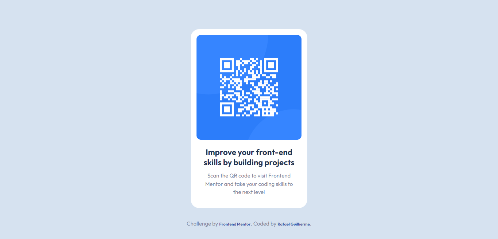

# Frontend Mentor - QR code component solution

This is a solution to the [QR code component challenge on Frontend Mentor](https://www.frontendmentor.io/challenges/qr-code-component-iux_sIO_H). Frontend Mentor challenges help you improve your coding skills by building realistic projects. 

## Table of contents

- [Overview](#overview)

  - [Screenshot](#screenshot)

  

    
  

  - [Links](#links)

  https://qr-code-component-rafael-guilherme.netlify.app/

- [My process](#my-process)

  First, setup the React and Typescript with Vite and installed Tailwind.
  Then I remove all the unecessary files and create the component for the qr-code.
  When finished, build and published in netlify

  - [Built with](#built-with)

    The QR-Code component was built with React, Typescript and Tailwind.
    I made a component for the qr-code and import it in the App.
    My styles were used in the component and the global styles were used in index.css file.

  - [What I learned](#what-i-learned)

    I train to work with React and Typescript. It was something that I need to keep training, to get better every day.

  - [Continued development](#continued-development)

    For this particular task, the job is done, but I will continue to improve my React skills in the next projects.

  - [Useful resources](#useful-resources)

  Vite for building React.

- [Author](#author)

  Website - [Rafael Guilherme](https://rafaelg-portfolio.netlify.app/)
  Frontend Mentor - [@Rafael-Guilherme](https://www.frontendmentor.io/profile/Rafael-Guilherme)
